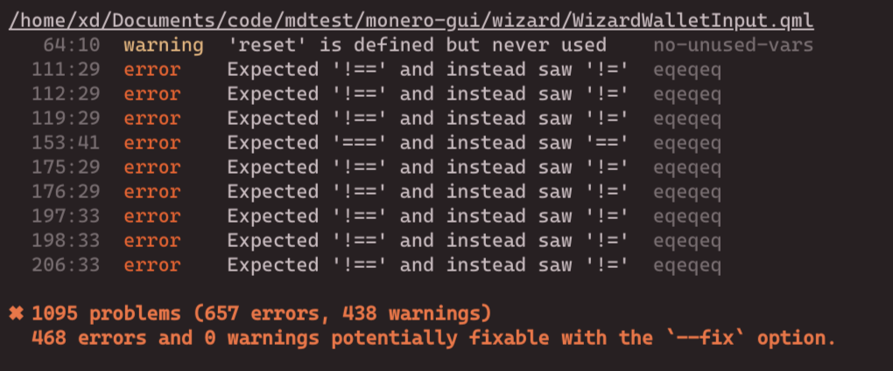
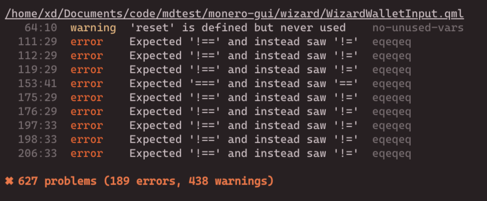

# QML Eslint Plugin

## Overview

Validation tool designed to enforce coding standards and best practices in QML files. The linter serves as an ESLint plugin, helping developers maintain consistent code quality through a set of predefined rules. It leverages the `@oltodo/qml-parser` library to parse QML files as AST and `Eslint` to provide meaningful feedback on potential issues.

- end goal eslint plugin for validation
- samples from monero-gui-wallet

## Features

- **Rule-Based Validation**: Check your QML code against various configurable rules.
- **JavaScript Code Block Parsing**: Validates JavaScript code blocks within QML files.
- **Report Generation**: Detailed reporting of linting issues, including the type of issue and the affected code.

## Installation
You'll first need to install [ESLint](https://eslint.org/) in your project:

```sh
npm i eslint --save-dev
```
### Use Plugin From NPM
Install from npm
```sh
 npm i eslint-plugin-qml-linter-xd
```
Next go to [Usage](#usage)


### Use PLugin From Source code

Clone the repository:

```bash
git clone https://github.com/Justxd22/qml-linter-xd
cd qml-linter-xd
```

Next, link `eslint-plugin-qml-linter-xd`:

```sh
npm link
```

Next go to your QML project and install the link
```sh
cd SOME_QML_PROJECT/
npm link eslint-plugin-qml-linter-xd
```
Next go to [Usage](#usage)


## Usage
- Install the plugin
- In your [configuration file](https://eslint.org/docs/latest/use/configure/configuration-files#configuration-file), import the plugin `eslint-plugin-qml-linter-xd` and add `qml.processors.qml` as a processor
- Then configure js rules you want to use under the `rules` key.
- Next go to [Run](#run)

## or use this config


```js
import qml from "eslint-plugin-qml-linter-xd";


export default [
  {
    files: ["**/*.js"],
    languageOptions: {
      ecmaVersion: "latest", // Modern JavaScript
      sourceType: "module",
    },
    rules: {
      "no-unused-vars": "warn", // Example: prevent unused variables
      "no-console": "warn", // Example: warn on console statements
      "semi": ["error", "always"], // Enforce semicolons
      "eqeqeq": ["error", "always"], // Require === and !== instead of == and !=
    },
  },

  {
    files: ["**/*.qml"],
    processor: qml.processors.qml,
  },

];
```
## RUN
Lint:
```sh
npx eslint .
```
Lint & Fix:
```sh
npx eslint . --fix
```

## Working sample
Running these rules on the whole monero-gui repo:
- eqeqeq
- no-unused-vars
- no-console
- semi
### Before `--fix`

### After `--fix`


```bash
❯ npx eslint monero-gui

Preprocessing Input: /home/xd/Documents/code/mdtest/monero-gui/MiddlePanel.qml
Preprocessing Input: /home/xd/Documents/code/mdtest/monero-gui/LeftPanel.qml
Preprocessing Input: /home/xd/Documents/code/mdtest/monero-gui/components/AdvancedOptionsItem.qml
Preprocessing Input: /home/xd/Documents/code/mdtest/monero-gui/components/CheckBox.qml
Preprocessing Input: /home/xd/Documents/code/mdtest/monero-gui/components/CheckBox2.qml
Preprocessing Input: /home/xd/Documents/code/mdtest/monero-gui/components/ContextMenu.qml
Preprocessing Input: /home/xd/Documents/code/mdtest/monero-gui/components/ContextMenuItem.qml
................................................

................................................
/home/xd/Documents/code/mdtest/monero-gui/wizard/WizardRestoreWallet3.qml
  41:5  warning  'pageHeight' is assigned a value but never used    no-unused-vars
  42:5  warning  'viewName' is assigned a value but never used      no-unused-vars
  43:5  warning  'recoveryMode' is assigned a value but never used  no-unused-vars

/home/xd/Documents/code/mdtest/monero-gui/wizard/WizardRestoreWallet4.qml
  40:5  warning  'pageHeight' is assigned a value but never used  no-unused-vars
  42:5  warning  'viewName' is assigned a value but never used    no-unused-vars

/home/xd/Documents/code/mdtest/monero-gui/wizard/WizardSummary.qml
  69:113  error  Expected '===' and instead saw '=='  eqeqeq
  76:109  error  Expected '===' and instead saw '=='  eqeqeq

/home/xd/Documents/code/mdtest/monero-gui/wizard/WizardSummaryItem.qml
  38:5  warning  'header' is assigned a value but never used  no-unused-vars
  39:5  warning  'value' is assigned a value but never used   no-unused-vars

/home/xd/Documents/code/mdtest/monero-gui/wizard/WizardWalletInput.qml
   64:10  warning  'reset' is defined but never used    no-unused-vars
  111:29  error    Expected '!==' and instead saw '!='  eqeqeq
  112:29  error    Expected '!==' and instead saw '!='  eqeqeq
  119:29  error    Expected '!==' and instead saw '!='  eqeqeq
  153:41  error    Expected '===' and instead saw '=='  eqeqeq
  175:29  error    Expected '!==' and instead saw '!='  eqeqeq
  176:29  error    Expected '!==' and instead saw '!='  eqeqeq
  197:33  error    Expected '!==' and instead saw '!='  eqeqeq
  198:33  error    Expected '!==' and instead saw '!='  eqeqeq
  206:33  error    Expected '!==' and instead saw '!='  eqeqeq

✖ 627 problems (189 errors, 438 warnings)

```

## Support me

- xmr: `433CbZXrdTBQzESkZReqQp1TKmj7MfUBXbc8FkG1jpVTBFxY9MCk1RXPWSG6CnCbqW7eiMTEGFgbHXj3rx3PxZadPgFD3DX`
- xmr: `4ACPJKijtYsBn1vsYdjS6sLavgvvyEVYg54adcHGYepUMFi8sUttk9obNfaRv3TCMZN5pMeHLiTTpHjAdTkLYPDr33BBRh5`
- birdpay: `@_xd222`

## Contributing
Contributions are welcome! Please feel free to submit a pull request or open an issue for any bugs or feature requests.

## License
This project is licensed under the GPLv3 License. See the LICENSE file for more information.
